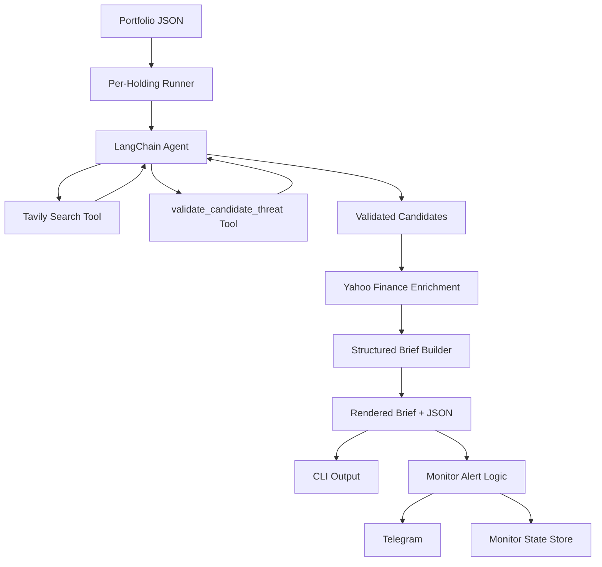

# Technical Documentation

For installation, credentials, commands, and troubleshooting, see [SETUP.md](SETUP.md). This document explains the current implementation: architecture, control flow, data contracts, validation, ranking, monitor state, Telegram, MongoDB, tracing, and evaluation.

## 1. System Purpose

Portfolio Threat Agent is a local LangChain application that monitors a stock portfolio for sourced, negative catalysts. It is built around a simple operating model:

- the agent discovers candidate threats with Tavily
- a lightweight validation tool (LLM as judge) approves or rejects each candidate against retrieved source snippets
- the application enriches approved candidates with Yahoo Finance data
- structured ranking turns candidates into portfolio-aware alerts
- monitor mode sends Telegram alerts only when validated new threats exist

The system deliberately avoids trading advice. It does not predict price moves, recommend buy/sell actions, or change stop levels.

## 2. High-Level Architecture



The implementation keeps agent-callable tools narrow:

- `tavily_search`
- `validate_candidate_threat`

Market data, final brief assembly, dedupe, and notification routing are application responsibilities.

## 3. Key Files

```text
portfolio_threat_agent/
  agent.py          # agent construction, streaming, per-holding orchestration
  tools.py          # Tavily wrapper, search budget, candidate validation, brief assembly
  threats.py        # structured brief models, materiality ranking, rendering
  market_data.py    # yfinance quote and price-reaction helpers
  source_parsing.py # Tavily result parsing
  monitor.py        # long-running monitor loop and scheduled alert dedupe
  telegram.py       # Telegram polling, commands, portfolio upload, sendMessage
  config.py         # local JSON and Mongo-backed monitor config/state stores
  evaluation.py     # historical agent evaluation harness
  models.py         # OpenAI chat model factory
  prompts.py        # system and judge prompts
  dev_cli.py        # Typer CLI
```

Supporting files:

```text
examples/portfolio.json
examples/golden_portfolio.json
examples/eval_cases.json
tests/test_agent.py
```

## 4. Runtime Flow

### 4.1 Portfolio Loading

`Portfolio.from_json(...)` loads positions from the supplied JSON file. Each position must have:

- `ticker`
- `shares`

Optional fields:

- `stop_price`
- `sector`

The portfolio is later enriched with prices so book weight can be calculated as `shares * price`, not raw share count.

### 4.2 Per-Holding Processing

The application processes holdings one at a time. This was an intentional performance and relevance choice:

- the agent sees a smaller context
- searches stay targeted to the holding
- duplicate source processing is easier to control
- one noisy ticker does not consume the whole portfolio run

For each holding, the prompt contains:

- ticker
- company/sector context when available
- active date
- retrieval start/end dates
- portfolio context needed to reason about relevance

The agent is instructed to search for concrete negative catalysts, not generic “risk” headlines.

### 4.3 Agent Model

The default model is:

```text
gpt-4o-mini
```

`models.py` creates an OpenAI chat model using `OPENAI_API_KEY`. 
### 4.4 Tavily Search

The Tavily tool is configured to return source results, not Tavily's generated answer:

```python
TavilySearch(
    max_results=5,
    auto_parameters=True,
    include_answer=False,
    include_raw_content=False,
    include_domains=[...],
    exclude_domains=[...],
)
```

Important choices:

- `include_answer=False` prevents reliance on Tavily's own generated summary.
- `include_raw_content=False` keeps live runs token efficient.
- `max_results=5` keeps each search useful without flooding the agent.
- `auto_parameters=True` lets Tavily infer retrieval parameters when the agent does not specify them.
- quality finance/news domains are preferred.
- quote pages and pure market-data pages are excluded where practical.

### 4.5 Search Budget

Search volume is bounded in code, not only in the prompt.

The prompt asks for at most:

- three initial searches
- one focused follow-up

The tool wrapper enforces a per-holding budget of four Tavily calls. When the budget is exhausted, the tool returns a structured `search_budget_exhausted` result instead of calling Tavily again. This prevents expensive loops where the agent repeatedly searches slightly different wording.

### 4.6 Candidate Validation

When the agent sees a candidate threat in a Tavily result, it calls:

```text
validate_candidate_threat(ticker, event_type, source_url, claim, active_date)
```

The claim comes from the agent. It should be a close paraphrase of what the cited Tavily result says. The validation tool then looks up the cited URL in the current agent run's Tavily results and runs one lightweight judge over the source excerpt.

The validator returns one combined decision:

- `approved`
- `unsupported`
- `not_threat`

This replaced the initial two-step “faithfulness then threatness” shape. The current contract is simpler: a candidate is approved only if the cited source supports the claim and the claim is concrete negative news for the holding.

The validator also blocks:

- source URLs not returned by Tavily in the current run
- stock quote pages and pure price-data pages
- duplicate validations of the same ticker/source/event inside one agent run

It does not require Tavily results to contain a date field because Tavily commonly returns results without explicit published dates. The retrieval window is already passed into Tavily.

### 4.7 Market Enrichment

The agent does not call market-data tools. After validated candidates exist, the app fetches:

- current quote for live monitor runs
- as-of close for historical eval runs
- one-day price reaction context around the active date or catalyst date

Market data comes from `yfinance`.

Price reaction is context, not a filter. A threat can be valid even if the market has not moved yet.

### 4.8 Structured Brief Assembly

Approved candidates are converted into structured signals. The builder:

- maps each candidate to a portfolio holding
- attaches source URLs
- dedupes repeated sources
- computes market value and book weight when quotes are available
- computes distance to stop when stop and price are available
- assigns materiality
- renders both machine-readable JSON and human-readable text

The main output object contains:

- `structured_brief`
- `rendered_brief`
- `signals`
- `citation_issues`
- `source_urls`

## 5. Materiality Ranking

Materiality is rule-based for transparency.

Inputs:

- position value as percent of book
- sector concentration as percent of book
- distance to stop
- whether the price has already fallen through the stop
- recency
- event severity
- price reaction context

Important ranking fixes in the current implementation:

- position rank uses `shares * price`, not share count
- sector concentration uses value, not number of positions
- below-stop positions are treated as urgent, not ignored
- PRD stop thresholds are used: HIGH within 10%, MED within 20%
- alert headers render book weight and stop distance

Rendered shape:

```text
HIGH · NVDA (8.2% of book · 4.1% above stop)
  <claim text> [1]
  Exposure: ~$41,000 · Distance to stop: 4.1%
  Why HIGH: ...
  [1] Reuters ... https://...
```

## 6. Citation And Source Contract

The current live path is candidate-first:

1. Tavily returns search results.
2. Agent proposes a candidate claim and source URL.
3. `validate_candidate_threat` verifies the URL exists in Tavily results.
4. The judge checks the claim against that source excerpt.
5. Only approved candidates enter the structured brief.

This avoids accepting final answer prose as truth. The rendered brief is assembled from approved candidates, not arbitrary LLM text.

The historical eval path also enforces that cited sources must not be after the active date when dated metadata is available. Undated live Tavily snippets are not automatically rejected.

## 7. Streaming

CLI runs stream a small progress formatter instead of dumping raw tool payloads. Example events:

```text
checking NVDA
agent called tavily_search(query='NVDA analyst downgrade price target cut ...')
tavily_search returned 5 results for '...'
agent called validate_candidate_threat(...)
validate_candidate_threat approved for NVDA
```

The final rendered brief is printed after all holdings finish.

## 8. Monitor Behavior

`PortfolioThreatMonitor` is the long-running process.

It:

- keeps an agent instance alive
- rereads monitor config between ticks
- recreates the agent only when model/tool config changes
- runs immediately on `/check_now`
- runs scheduled ticks based on `interval_seconds`
- sends scheduled Telegram alerts only for newly seen source URLs

Alert dedupe lives at the scheduled-alert layer. `/check_now` always returns the current result, even when the same source URL has been seen before.

## 9. Telegram

Telegram is the messaging interface for the local prototype.

Supported commands:

```text
/change_interval 30 mins
/set_monitoring True
/set_monitoring False
/check_now
/status
```

Telegram can also receive portfolio JSON. The bot validates it, writes it to `state/portfolios/`, records the chat ID, and updates monitor config with the portfolio path.

Telegram polling is hardened:

- long-poll socket timeout is longer than Telegram's hold timeout
- transient exceptions are caught
- polling retries after a short sleep
- offset is preserved across retry attempts

## 10. Persistence

The monitor supports two persistence backends through the same interface.

Local default:

```text
state/monitor_config.json
state/monitor_state.json
```

MongoDB when `MONGODB_URI` is set:

```text
config:<MONGODB_MONITOR_ID>
state:<MONGODB_MONITOR_ID>
```

Stored config fields include:

- `monitoring_enabled`
- `interval_seconds`
- `since`
- `instruction`
- `portfolio_path`
- `telegram_chat_id`
- `model`
- `max_results`

Stored state fields include:

- `alerted_source_urls`

MongoDB is used for runtime monitor coordination, not agent memory. Telegram-uploaded portfolio JSON payloads are still local files; Mongo stores the resulting `portfolio_path`.

## 11. LangSmith Tracing

LangSmith tracing is integrated across the agent workflow when `LANGSMITH_API_KEY` is set.

Traced areas include:

- model construction
- agent construction
- prompt construction
- Tavily tool calls
- candidate validation
- Yahoo Finance enrichment
- structured brief assembly
- materiality ranking
- evaluation cases
- Telegram delivery

This is mainly useful for debugging search quality, validation decisions, materiality ranking, and expensive agent loops.
This improves overall agent observability and monitoring.

## 12. Agent Evaluation

Historical runs are implemented as an evaluation harness..

Each eval case defines:

- portfolio path
- `start_date`
- `end_date`
- expected events
- optional instruction

Each expected event includes:

- `ticker`
- `event_type`
- `catalyst_date`
- `expected_materiality`
- optional reference sources and notes

Evaluation flow:

1. Load the portfolio.
2. Run the normal per-holding agent flow.
3. Bound Tavily to the historical retrieval window.
4. Use yfinance prices as of the eval `end_date`.
5. Build the structured brief.
6. Compare `structured_brief.signals` with gold labels.

Pass/fail rules:

- expected events must match ticker, event type, catalyst date, and materiality
- missing expected events fail
- materiality mismatches fail
- unexpected LOW signals are reported but allowed
- agent recursion-limit errors are captured as failed eval results instead of crashing the whole run

## 13. Failure Modes And Current Limits

Known limits:

- Search quality depends on Tavily retrieval and source availability.
- Validation can only check candidates the agent chooses to submit.
- The system does not crawl full articles when Tavily returns only short snippets.
- Telegram is local long polling, not a hosted multi-user messaging service.
- Mongo stores monitor config/state, not uploaded portfolio payloads.
- The eval dataset is small and manually curated.

These are acceptable for the current scope.
